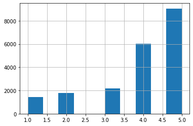
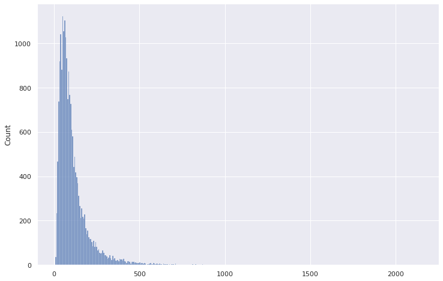
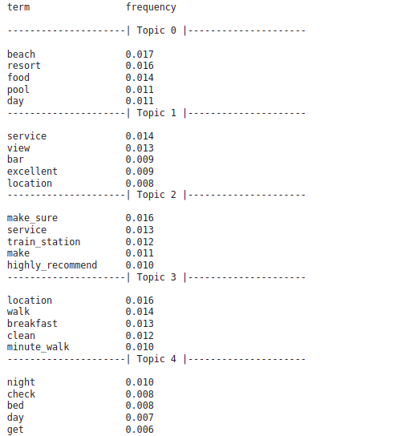
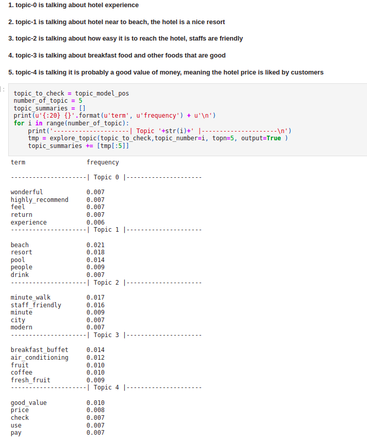
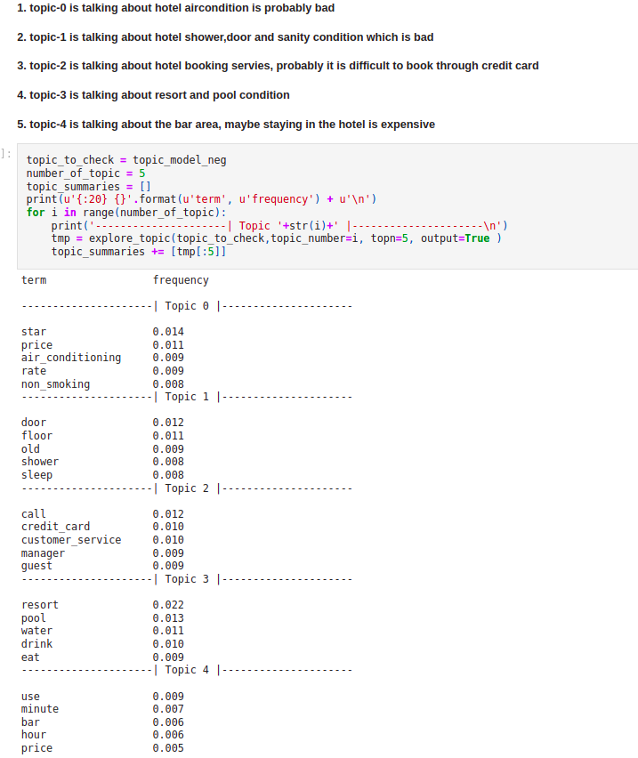

# tripadviser_reviews_analysis
analysis of tripadviser reviews, training a bert model for rating prediction and then doing topic modeling

### 1. Dataset Explanation:
    a. The tripadviser dataset has 20491 reviews with ratings from 1-5. My goal is to analyse this data, train a model for rating prediction and then do topic modeling to figure out import topics that can tell me about areas, where the hotel is doing good or bad.

    b. A quick EDA on the data shows that It has some reviews that are very long and they are in small numbers(outliers). I  removed around 262 such reviews. Also the ratings are skewed, meaning ratings like 1,2 has less number of reviews compared to 4,5 ratings 

    c. ratings distribution histogram

    
    d. text length distribution

### 2. Rating Prediction and Evaluation:
    a. I have trained a model using hugging face transformer for multi-class classification(bert-base-uncased)
    b. This model gave a f1 score of .65 on the test data. 
    c. As I checked the wrong outputs I figured out that some failure cases are actually hard to predict by human too. Also most of the wrong predictions are off by 1 values. Meaning if the review had an actual rating of 5, the predicted rating is 4.
    d. I found some 10 example on the test data where the model is failing badly. prediction is off by more than 3. Meaning if true label is 5 and predicted is 1 or 2.
    e. Improvement steps are mentioned on the evaluation notebook

### 3. Topic Modeling:
    a. I tried doing LDA topic modeling to figure out important topics on the entire review dataset
    c. The standard preprocessing steps are mentioned on the topic modelling notebook
    d. Doing topic modeling on the entire reviews didn't give much insights. It was hard to interpret the topics. (check the section **Result Analysis on Entire data** of the topic modelling notebook)
    d. here are some results from the topic modelling on the **entire data** 

    
    e.here are some results from the topic modelling on the **high rated data** 

    
    f.here are some results from the topic modelling on the **low rated data**

